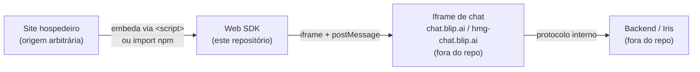

# Projeto: blip-chat-widget

## O que é

SDK JavaScript standalone (`libraryTarget: 'umd'`, distribuído via npm e
unpkg — ver [webpack.config.js](../../webpack.config.js) e
[package.json](../../package.json)) para embarcar chatbots BLiP em sites de
terceiros. Publica um único arquivo `dist/blip-chat.js`. API pública de
entrada: classe `BlipChat` ([src/BlipChat.js](../../src/BlipChat.js)), padrão
builder.

Cria a UI de "botão flutuante + iframe de chat" no site hospedeiro, e delega
toda a UI de conversa (mensagens, formulários, menus, anexos) ao conteúdo do
iframe, que vive fora deste repositório.

## Arquitetura em 4 camadas

- **Site hospedeiro**: qualquer domínio de terceiro que inclua o script.
  Precisa estar cadastrado no BLiP portal (ver [README.md](../../README.md)).
- **Web SDK (este repo)**: gerencia o botão flutuante, cria/destrói o
  `<iframe>`, e troca mensagens com ele via `window.postMessage`. Não
  renderiza nenhum conteúdo de conversa.
- **Iframe de chat**: aplicação separada, servida por `chat.blip.ai`
  (produção) ou `hmg-chat.blip.ai` (homologação), resolvida por instância em
  `BlipChatWidget._setChatUrlEnvironment`
  ([src/BlipChatWidget.js](../../src/BlipChatWidget.js)). Contém toda a UI de
  mensagens, anexos, menus e formulários.
- **Backend/Iris**: infraestrutura de conversação do BLiP, fora do alcance
  deste SDK; qualquer dado de "contenção" ou desfecho de conversa não
  trafega no protocolo `postMessage` deste widget.

## Restrição estrutural central

Confirmado em [src/static/chat.html](../../src/static/chat.html): o único
template HTML deste repositório contém apenas o botão flutuante (ícone e SVG
de fechar). O elemento `<iframe>` em si é criado programaticamente em
`_createIframe()` ([src/BlipChatWidget.js](../../src/BlipChatWidget.js)) e
aponta para uma URL externa — nenhum HTML de conversa é gerado ou servido por
este repositório.

**Consequência permanente**: qualquer demanda de produto que exija nova UI de
conversa (formulários nativos, menus estruturados, captura de foto, anexos,
etc.) é estruturalmente `BLOCKED_EXTERNAL` para este SDK — a implementação
pertence ao lado do iframe, não a este código. Ver [roadmap.md](./roadmap.md)
para o mapeamento item a item.

## Superfície pública

API construída via builder em `BlipChat` (encadeável, retorna `this`):
`withAppKey`, `withAuth`, `withConnectionData`, `withAccount`, `withTarget`,
`withEventHandler`, `withCustomStyle`, `withCustomMessageMetadata`,
`withCustomCommonUrl`, `withCustomSearchParams`, `withoutHistory`, `build()`.

Métodos de instância pós-`build()`: `toogleChat()` (sic — nome mantido por
compatibilidade), `destroy()`, `sendMessage()`, `sendCommand()`,
`setDraftMessage()`, `updateConnectionData()`, `updateCustomStyle()`.

Eventos suportados via `withEventHandler(name, handler)`: `OnEnter`,
`OnLeave`, `OnLoad`, `OnCreateAccount` — todos sem argumentos, ligados ao
ciclo de vida da UI/conexão do widget, nunca ao conteúdo ou desfecho da
conversa (esse dado não está disponível neste lado do protocolo).

### Débito conhecido, intocado deliberadamente

`BlipChat` expõe getters estáticos mortos: `CUSTOM_SEND_MESSAGE` (valor
`'CustomSendMessage'`). Não há nenhum uso desse valor em
`BlipChatWidget.js` nem em `Constants.js` — é resquício de uma feature
abandonada. Preservado intocado por não ser parte do escopo de nenhuma
mudança recente; não remover sem confirmar ausência de consumidores externos
dependendo dessa constante pública.
